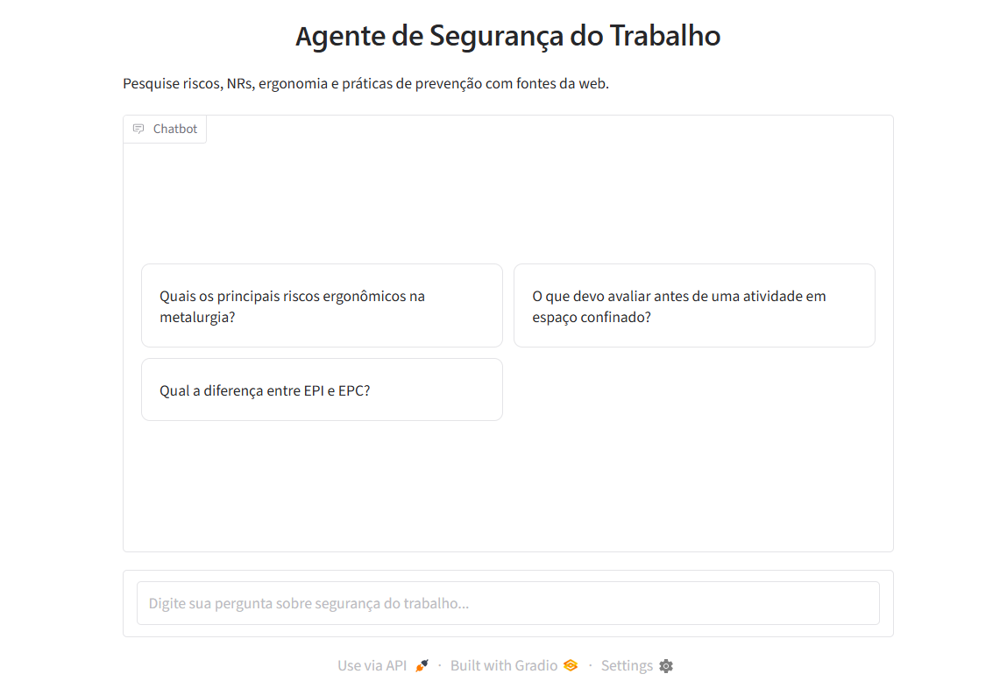
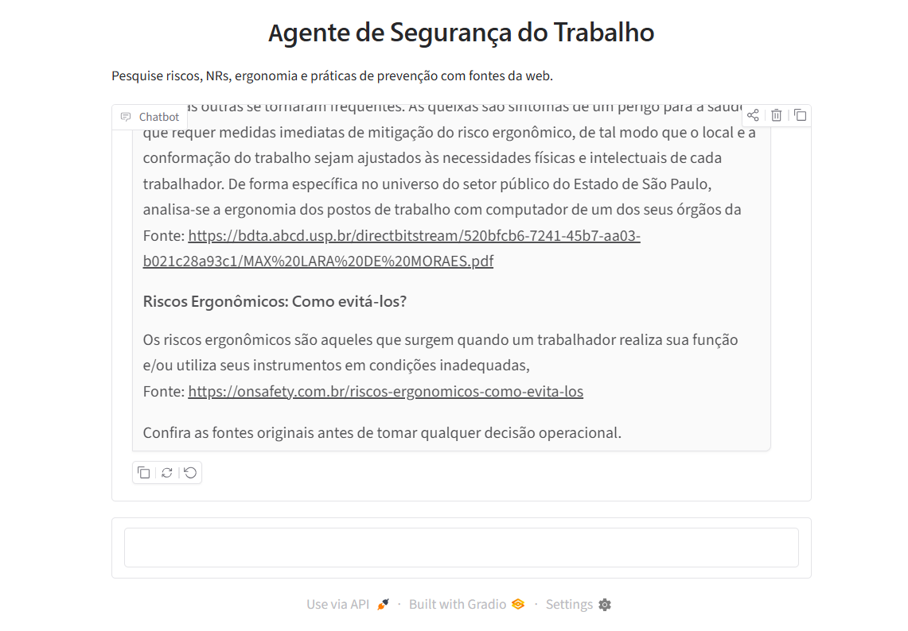
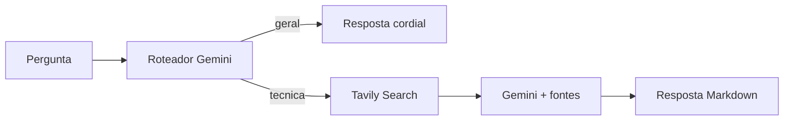

# Agente de Seguranca do Trabalho

Agente conversacional para pesquisa assistida em seguranca do trabalho industrial. Ele usa **LangGraph** para rotear a intencao da pergunta, **Gemini** para raciocinio e redacao, e **Tavily** para buscar fontes atuais na web.

> Este projeto tem finalidade educacional. As respostas nao substituem um profissional legalmente habilitado, uma analise de risco, o PGR ou os procedimentos internos da empresa.

## O que o projeto demonstra

- Roteamento de intencao entre conversa geral e pergunta tecnica.
- Busca web condicionada para temas de SST, NRs, ergonomia, EPI/EPC e riscos ocupacionais.
- Respostas em Markdown com fontes citadas.
- Workflow explicito e testavel com LangGraph.
- Interface Gradio pronta para demonstracao local.
- Segredos fora do codigo, carregados por variaveis de ambiente.

## Demonstração

Tela inicial da aplicação:



Consulta técnica com pesquisa de fontes:



## Arquitetura



O fluxo principal esta em `src/agente_seguranca/graph.py`. O roteador escolhe um caminho; somente perguntas tecnicas acionam a busca web. Isso reduz chamadas desnecessarias e deixa o comportamento observavel.

## Requisitos

- Python 3.10 ou superior
- Chave `GOOGLE_API_KEY`
- Chave `TAVILY_API_KEY`

## Instalacao

```bash
git clone <url-do-seu-repositorio>
cd agente-seguranca-trabalho
python -m venv .venv
.venv\Scripts\activate  # Windows
# source .venv/bin/activate  # macOS/Linux
python -m pip install --upgrade pip
pip install -e .
copy .env.example .env  # Windows PowerShell: Copy-Item .env.example .env
```

Preencha o arquivo `.env` com suas chaves. Nunca publique esse arquivo.

## Execucao

```bash
python -m agente_seguranca
```

A interface sera aberta pelo Gradio no endereco local exibido no terminal. Tambem e possivel usar o comando instalado:

```bash
agente-seguranca
```

## Testes

Os testes unitarios nao fazem chamadas externas:

```bash
pip install pytest
pytest
```

## Estrutura

```text
.
├── .env.example
├── Agente_SST.ipynb
├── docs/
│   └── images/
│       ├── consulta-tecnica.png
│       └── tela-inicial.png
├── README.md
├── pyproject.toml
├── src/
│   └── agente_seguranca/
│       ├── __main__.py
│       ├── graph.py
│       └── ui.py
└── tests/
    └── test_graph.py
```

## Observacoes de uso responsavel

- Confira a fonte original antes de tomar qualquer decisao operacional.
- Normas e orientacoes podem mudar; confirme a versao vigente.
- Nao envie dados pessoais, informacoes confidenciais ou detalhes sensiveis de incidentes para APIs externas.
- Em uma evolucao de producao, adicione autenticacao, observabilidade, avaliacao de respostas e uma base normativa versionada.

## Publicação no GitHub

O projeto está preparado para ser versionado. Antes do primeiro commit, confirme que o arquivo `.env` não aparece no status:

```bash
git init
git status --short
git add .
git status --short
git commit -m "feat: cria agente de seguranca do trabalho"
git branch -M main
git remote add origin https://github.com/SEU_USUARIO/SEU_REPOSITORIO.git
git push -u origin main
```

O `.gitignore` bloqueia `.env`, caches, ambientes virtuais e artefatos de build. Nunca substitua as variáveis vazias de `.env.example` por chaves reais.
